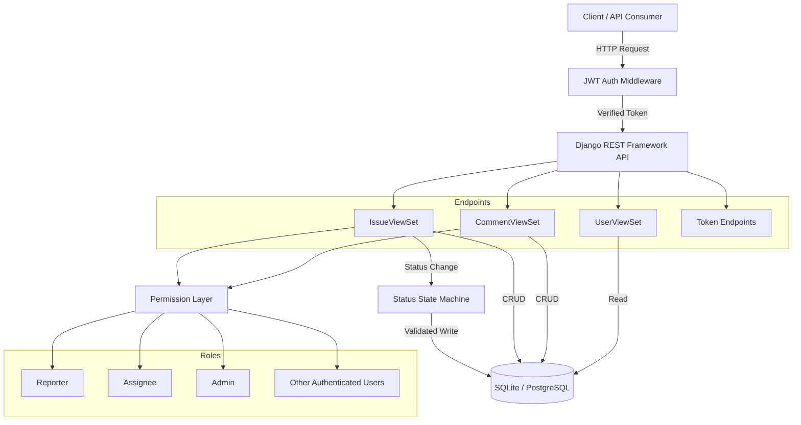

# IssuesTracker

[](https://www.python.org/) [](https://www.djangoproject.com/) [](https://www.django-rest-framework.org/) [](https://www.docker.com/) [](LICENSE)


## Introduction

**IssuesTracker** is a backend API service for tracking issues/bugs in software projects. It provides a complete CRUD interface for issue management, with support for user authentication, issue assignment, tagging, commenting, and filtering.

The API enforces a strict **status state machine** — only authorized roles (Reporter, Assignee, Admin) can perform specific status transitions. Write access is restricted to the Reporter and Assignee of an issue; other authenticated users have read-only access.

---

## Table of Contents

- [Introduction](#introduction)
- [Features](#features)
- [Quick Start](#quick-start)
  - [Local Development](#local-development)
  - [Docker](#docker)
- [Tech Stack](#tech-stack)
- [Architecture](#architecture)
- [Project Structure](#project-structure)
- [Environment Variables](#environment-variables)
- [API Endpoints](#api-endpoints)
- [Status Transition Rules](#status-transition-rules)
- [Running Tests](#running-tests)
- [License](#license)

---

## Features

- • **JWT Authentication** — Secure token-based auth via `simplejwt`
- • **CRUD Operations** — Full create, read, update, delete for issues and comments
- • **Role-Based Permissions** — Reporter, Assignee, and Admin each have distinct write privileges
- • **Status State Machine** — Enforced issue status transitions with role-based validation
- • **Filtering** — Filter issues by `status`, `priority`, `assignee`, `reporter`
- • **Pagination** — Built-in page number pagination (10 items/page)
- • **Rate Limiting** — Throttle protection for both anonymous and authenticated users
- • **Custom User Model** — Extensible `AbstractUser` for future enhancements
- • **Tagging System** — Categorize issues with color-coded tags
- • **Comments** — Users can comment on issues; only the poster can edit/delete their own comments
- • **User Endpoints** — Read-only user listing with linked issues and comments
- • **Docker Ready** — One-command deployment with Docker Compose
- • **CI/CD** — GitHub Actions automated testing on every push

## Quick Start

### Prerequisites

- • Python 3.14+
- • pip

### Local Development

```bash
# 1. Clone the repository
git clone https://github.com/your-username/IssuesTracker.git
cd IssuesTracker

# 2. Create and activate virtual environment
python -m venv venv
source venv/bin/activate  # macOS / Linux
venv\Scripts\activate     # Windows

# 3. Install dependencies
pip install -r requirements.txt

# 4. Run database migrations
python manage.py migrate

# 5. Create a superuser (optional)
python manage.py createsuperuser

# 6. Start the development server
python manage.py runserver
```

The API will be available at `http://127.0.0.1:8000/api/`.

### Docker

```bash
# Build and start all services
docker compose up --build

# Run in detached mode
docker compose up --build -d
```

The API will be available at `http://localhost:8000/api/`.

## Tech Stack

| Category | Technology |
|---|---|
| Framework | Django 6.0.3 |
| API | Django REST Framework 3.16 |
| Authentication | SimpleJWT 5.5 |
| Filtering | django-filter 25.2 |
| Database | SQLite (dev) / PostgreSQL (docker) |
| Testing | pytest + pytest-django |
| CI | GitHub Actions |
| Server | Gunicorn |
| Container | Docker + Docker Compose |

## Architecture

The system follows a layered architecture with role-based access control and a strict status state machine:



### Flow Explanation

**Write Path (Authenticated):**

1. Client sends request with JWT Bearer token
2. `JWTAuthentication` middleware validates the token
3. Request is routed to the appropriate ViewSet (`IssueViewSet`, `CommentViewSet`)
4. `IsReporterOrAssigneeOrReadOnly` / `IsPosterOrReadOnly` permission class checks the caller's role
5. For status changes, the `IssueSerializer` validates the transition against the **Status State Machine**
6. On success, the change is persisted to the database

**Read Path:**

1. Any authenticated user can `GET` issues, comments, and users
2. Filtering is applied via query parameters (`status`, `priority`, `assignee`, `reporter`)
3. Results are paginated (10 items per page)

**Why this design?**

- **Role-Based Permissions:** Prevents unauthorized status changes or data modification — only the Reporter/Assignee of a specific issue has write access
- **Status State Machine:** Enforces a valid issue lifecycle (`OPEN → IN_PROGRESS → RESOLVED → CLOSED`), preventing nonsensical state jumps
- **JWT Authentication:** Stateless, scalable auth without server-side session storage

## Project Structure

```
IssuesTracker/
├── .github/
│   └── workflows/
│       └── ci.yml          # GitHub Actions CI pipeline
├── config/
│   ├── settings.py         # Django settings (env-aware)
│   ├── urls.py             # Root URL configuration
│   └── wsgi.py             # WSGI entry point
├── issues/
│   ├── models.py           # User, Issue, Tag, Comment models
│   ├── views.py            # IssueViewSet, UserViewSet, CommentViewSet
│   ├── serializers.py      # IssueSerializer (status machine), CommentSerializer, UserSerializer
│   ├── permissions.py      # IsReporterOrAssigneeOrReadOnly, IsPosterOrReadOnly
│   └── tests.py            # pytest test cases (22 tests)
├── Dockerfile              # Container image definition
├── docker-compose.yml      # Multi-service orchestration
├── requirements.txt        # Python dependencies
├── pytest.ini              # pytest configuration
├── manage.py               # Django management script
└── README.md
```


## Environment Variables

The application reads the following environment variables. All have sensible defaults for local development — you only need to set them in production or Docker environments.

| Variable | Description | Default |
|---|---|---|
| `SECRET_KEY` | Django secret key | insecure dev key (auto-provided) |
| `DEBUG` | Enable debug mode | `True` |
| `ALLOWED_HOSTS` | Comma-separated allowed hosts | `localhost,127.0.0.1` |
| `DB_HOST` | PostgreSQL host (if set, uses PG) | (unset → SQLite) |
| `DB_NAME` | Database name | `issuestracker` |
| `DB_USER` | Database user | `admin` |
| `DB_PASS` | Database password | `password123` |
| `DB_PORT` | Database port | `5432` |

> **Note:** When `DB_HOST` is not set, the app automatically falls back to SQLite for local development.

## API Endpoints

### Authentication

| Method | Endpoint | Description |
|---|---|---|
| POST | `/api/token/` | Obtain JWT token pair |
| POST | `/api/token/refresh/` | Refresh access token |

### Issues

| Method | Endpoint | Description | Permission |
|---|---|---|---|
| GET | `/api/issues/` | List all issues | Authenticated |
| POST | `/api/issues/` | Create a new issue | Authenticated |
| GET | `/api/issues/{id}/` | Retrieve an issue | Authenticated |
| PUT | `/api/issues/{id}/` | Update an issue | Reporter or Assignee |
| PATCH | `/api/issues/{id}/` | Partial update | Reporter or Assignee |
| DELETE | `/api/issues/{id}/` | Delete an issue | Reporter or Admin |
| GET | `/api/issues/{id}/comments/` | List comments for an issue | Authenticated |

### Users

| Method | Endpoint | Description |
|---|---|---|
| GET | `/api/users/` | List all users |
| GET | `/api/users/{id}/` | Retrieve a user |
| GET | `/api/users/{id}/issues/` | List issues reported by a user |
| GET | `/api/users/{id}/comments/` | List comments posted by a user |

### Query Parameters

Filter issues using query parameters:

```
GET /api/issues/?status=OPEN&priority=HIGH&assignee=1
```

| Parameter | Values |
|---|---|
| `status` | `OPEN`, `IN_PROGRESS`, `RESOLVED`, `CLOSED` |
| `priority` | `LOW`, `MEDIUM`, `HIGH` |
| `assignee` | User ID |
| `reporter` | User ID |

## Status Transition Rules

Issue statuses follow a strict state machine. Unauthorized or invalid transitions will return `400 Bad Request`.

```
OPEN ──(Assignee)──► IN_PROGRESS ──(Assignee)──► RESOLVED ──(Reporter/Admin)──► CLOSED
                          │
              (Reporter) ──► IN_PROGRESS (reopen)
```

| From | To | Allowed Role |
|---|---|---|
| `OPEN` | `IN_PROGRESS` | Assignee only |
| `IN_PROGRESS` | `RESOLVED` | Assignee only |
| `RESOLVED` | `CLOSED` | Reporter or Admin |
| `RESOLVED` | `IN_PROGRESS` | Reporter only (reopen) |
| `CLOSED` | (any) | ❌ Not allowed |

> **Note:** New issues must always be created with status `OPEN`.

## Running Tests

```bash
# Run all tests
pytest

# Run with verbose output
pytest -v
```

### Test Coverage (22 cases)

| Category | Tests |
|---|---|
| Authentication | 1 |
| Permission (CRUD) | 2 |
| Create validation | 2 |
| Read-only fields | 1 |
| OPEN → IN\_PROGRESS | 3 |
| IN\_PROGRESS → RESOLVED | 2 |
| RESOLVED → CLOSED | 3 |
| RESOLVED → IN\_PROGRESS | 3 |
| CLOSED (terminal state) | 2 |

## License

This project is licensed under the [MIT License](LICENSE).
